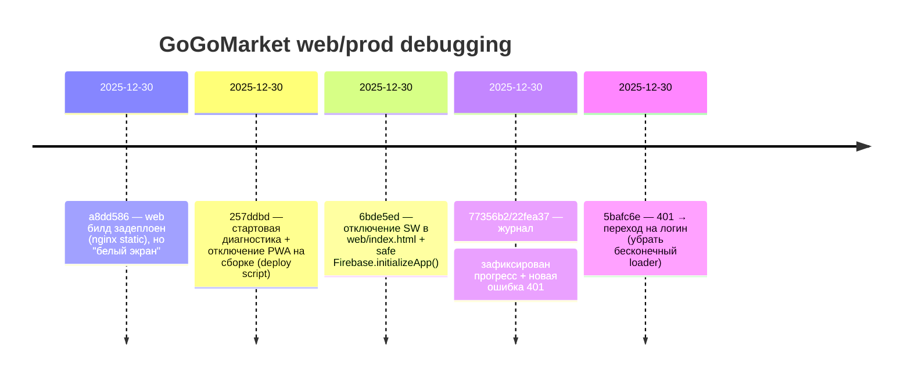

# GoGoMarket — TZ Progress (Visual)

## Таймлайн (последние ключевые шаги)



## Схема компонентов (как сейчас)

```mermaid
flowchart LR
  U[User Browser] -->|HTTPS (self-signed)| N[Nginx on 165.232.81.31]
  N -->|static| W[Flutter Web: /var/www/gogomarket]
  W -->|HTTP API calls| API[Fly.io backend: app-owphiuvd.fly.dev]

  subgraph Notes
    SW[Service Worker/PWA]:::warn
    AUTH[GET /api/auth/me]:::warn
  end

  W -. disabled .-> SW
  API -->|401 when token invalid| AUTH

  classDef warn fill:#fff3cd,stroke:#856404,color:#856404;
```

## Матрица проблем

| Problem | Symptom | Root cause | Fix status |
|---|---|---|---|
| White screen | пустой экран / `165.232.81.31:50` | self-signed SSL + SW + silent startup failures | mitigated (SW off + visible errors) |
| Infinite loading | чёрный экран со спиннером “вечно” | 401 на `/api/auth/me` и роутинг оставался на spinner | fixed in app (route to login) |
| Unsplash 404 | картинки не грузятся | внешние URL невалидны | not addressed |
| WebGL warning | CPU rendering | окружение/браузер без WebGL | not addressed |

